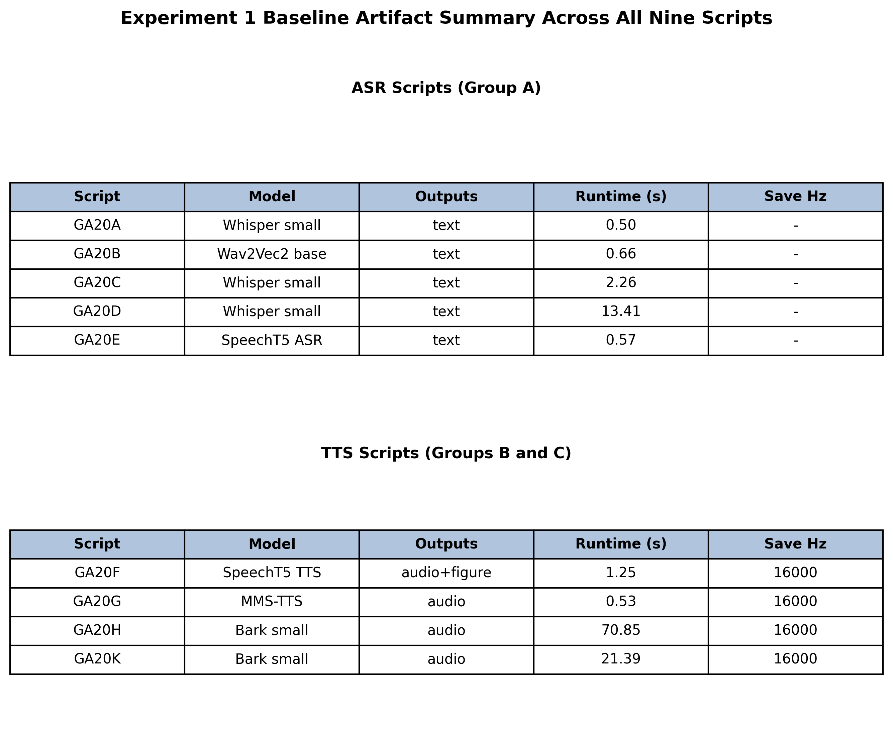
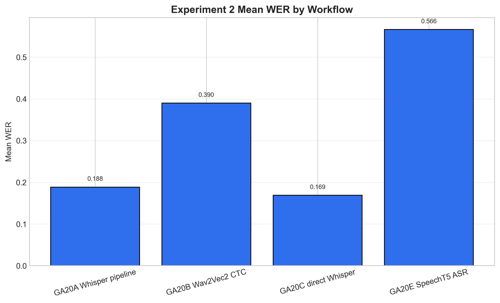
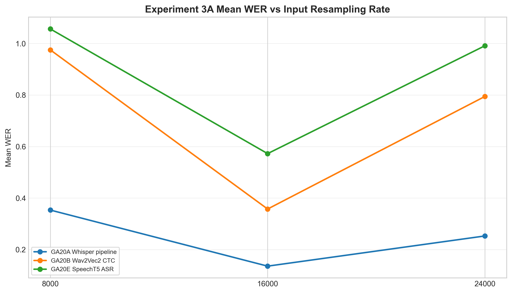
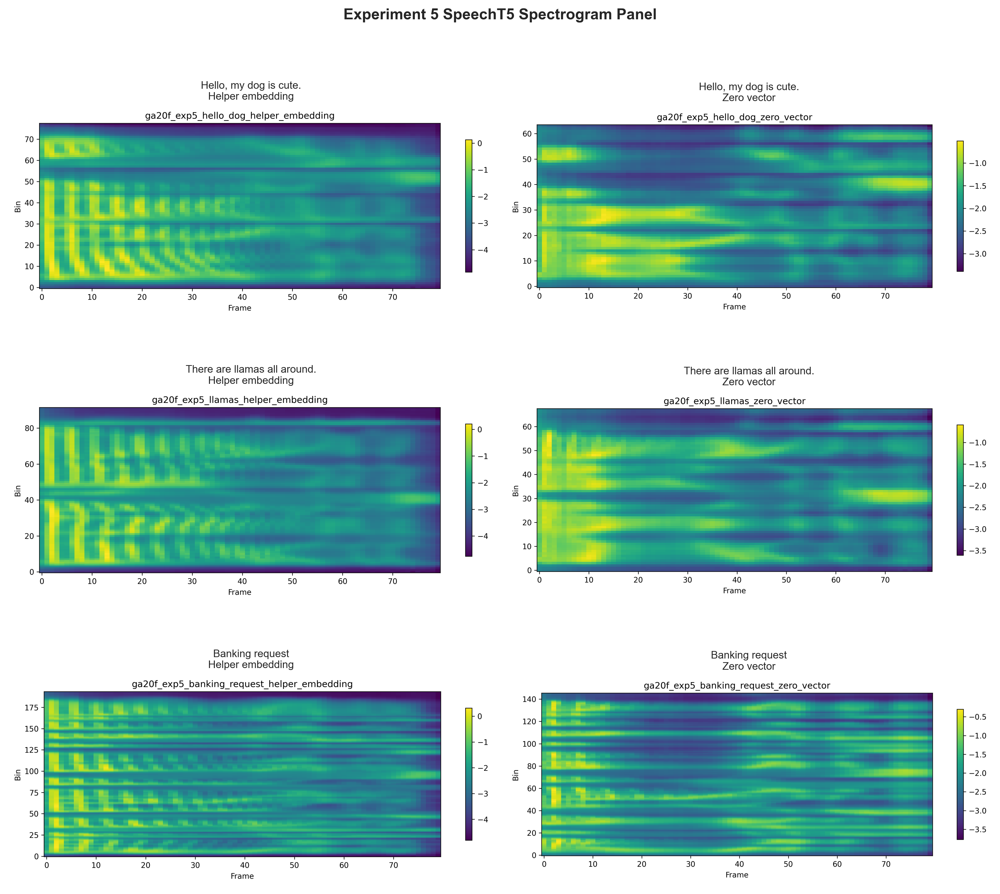
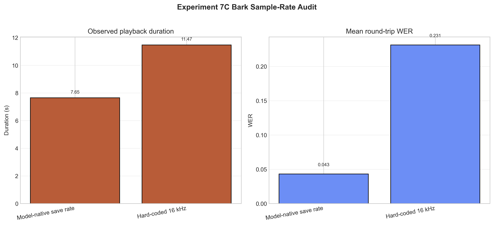
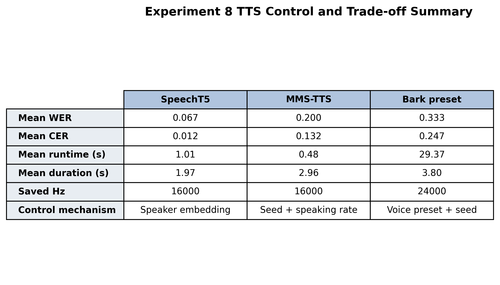

# Speech AI with Transformers: ASR, TTS, and Generative Audio

### A Systematic Experimental Study of Automatic Speech Recognition, Text-to-Speech Synthesis, and Prompt-Conditioned Audio Generation Using Whisper, Wav2Vec2, SpeechT5, MMS-TTS, and Bark

---

<svg xmlns="http://www.w3.org/2000/svg" width="109" height="20" role="img" aria-label="Python: 3.10+"><title>Python: 3.10+</title><linearGradient id="s" x2="0" y2="100%"><stop offset="0" stop-color="#bbb" stop-opacity=".1"/><stop offset="1" stop-opacity=".1"/></linearGradient><clipPath id="r"><rect width="109" height="20" rx="3" fill="#fff"/></clipPath><g clip-path="url(#r)"><rect width="66" height="20" fill="#555"/><rect x="66" width="43" height="20" fill="#007ec6"/><rect width="109" height="20" fill="url(#s)"/></g><g fill="#fff" text-anchor="middle" font-family="Verdana,Geneva,DejaVu Sans,sans-serif" text-rendering="geometricPrecision" font-size="110"><image x="5" y="3" width="14" height="14" href="data:image/svg+xml;base64,PHN2ZyBmaWxsPSJ3aGl0ZSIgcm9sZT0iaW1nIiB2aWV3Qm94PSIwIDAgMjQgMjQiIHhtbG5zPSJodHRwOi8vd3d3LnczLm9yZy8yMDAwL3N2ZyI+PHRpdGxlPlB5dGhvbjwvdGl0bGU+PHBhdGggZD0iTTE0LjI1LjE4bC45LjIuNzMuMjYuNTkuMy40NS4zMi4zNC4zNC4yNS4zNC4xNi4zMy4xLjMuMDQuMjYuMDIuMi0uMDEuMTNWOC41bC0uMDUuNjMtLjEzLjU1LS4yMS40Ni0uMjYuMzgtLjMuMzEtLjMzLjI1LS4zNS4xOS0uMzUuMTQtLjMzLjEtLjMuMDctLjI2LjA0LS4yMS4wMkg4Ljc3bC0uNjkuMDUtLjU5LjE0LS41LjIyLS40MS4yNy0uMzMuMzItLjI3LjM1LS4yLjM2LS4xNS4zNy0uMS4zNS0uMDcuMzItLjA0LjI3LS4wMi4yMXYzLjA2SDMuMTdsLS4yMS0uMDMtLjI4LS4wNy0uMzItLjEyLS4zNS0uMTgtLjM2LS4yNi0uMzYtLjM2LS4zNS0uNDYtLjMyLS41OS0uMjgtLjczLS4yMS0uODgtLjE0LTEuMDUtLjA1LTEuMjMuMDYtMS4yMi4xNi0xLjA0LjI0LS44Ny4zMi0uNzEuMzYtLjU3LjQtLjQ0LjQyLS4zMy40Mi0uMjQuNC0uMTYuMzYtLjEuMzItLjA1LjI0LS4wMWguMTZsLjA2LjAxaDguMTZ2LS44M0g2LjE4bC0uMDEtMi43NS0uMDItLjM3LjA1LS4zNC4xMS0uMzEuMTctLjI4LjI1LS4yNi4zMS0uMjMuMzgtLjIuNDQtLjE4LjUxLS4xNS41OC0uMTIuNjQtLjEuNzEtLjA2Ljc3LS4wNC44NC0uMDIgMS4yNy4wNXptLTYuMyAxLjk4bC0uMjMuMzMtLjA4LjQxLjA4LjQxLjIzLjM0LjMzLjIyLjQxLjA5LjQxLS4wOS4zMy0uMjIuMjMtLjM0LjA4LS40MS0uMDgtLjQxLS4yMy0uMzMtLjMzLS4yMi0uNDEtLjA5LS40MS4wOXptMTMuMDkgMy45NWwuMjguMDYuMzIuMTIuMzUuMTguMzYuMjcuMzYuMzUuMzUuNDcuMzIuNTkuMjguNzMuMjEuODguMTQgMS4wNC4wNSAxLjIzLS4wNiAxLjIzLS4xNiAxLjA0LS4yNC44Ni0uMzIuNzEtLjM2LjU3LS40LjQ1LS40Mi4zMy0uNDIuMjQtLjQuMTYtLjM2LjA5LS4zMi4wNS0uMjQuMDItLjE2LS4wMWgtOC4yMnYuODJoNS44NGwuMDEgMi43Ni4wMi4zNi0uMDUuMzQtLjExLjMxLS4xNy4yOS0uMjUuMjUtLjMxLjI0LS4zOC4yLS40NC4xNy0uNTEuMTUtLjU4LjEzLS42NC4wOS0uNzEuMDctLjc3LjA0LS44NC4wMS0xLjI3LS4wNC0xLjA3LS4xNC0uOS0uMi0uNzMtLjI1LS41OS0uMy0uNDUtLjMzLS4zNC0uMzQtLjI1LS4zNC0uMTYtLjMzLS4xLS4zLS4wNC0uMjUtLjAyLS4yLjAxLS4xM3YtNS4zNGwuMDUtLjY0LjEzLS41NC4yMS0uNDYuMjYtLjM4LjMtLjMyLjMzLS4yNC4zNS0uMi4zNS0uMTQuMzMtLjEuMy0uMDYuMjYtLjA0LjIxLS4wMi4xMy0uMDFoNS44NGwuNjktLjA1LjU5LS4xNC41LS4yMS40MS0uMjguMzMtLjMyLjI3LS4zNS4yLS4zNi4xNS0uMzYuMS0uMzUuMDctLjMyLjA0LS4yOC4wMi0uMjFWNi4wN2gyLjA5bC4xNC4wMXptLTYuNDcgMTQuMjVsLS4yMy4zMy0uMDguNDEuMDguNDEuMjMuMzMuMzMuMjMuNDEuMDguNDEtLjA4LjMzLS4yMy4yMy0uMzMuMDgtLjQxLS4wOC0uNDEtLjIzLS4zMy0uMzMtLjIzLS40MS0uMDgtLjQxLjA4eiIvPjwvc3ZnPg=="/><text aria-hidden="true" x="425" y="150" fill="#010101" fill-opacity=".3" transform="scale(.1)" textLength="390">Python</text><text x="425" y="140" transform="scale(.1)" fill="#fff" textLength="390">Python</text><text aria-hidden="true" x="865" y="150" fill="#010101" fill-opacity=".3" transform="scale(.1)" textLength="330">3.10+</text><text x="865" y="140" transform="scale(.1)" fill="#fff" textLength="330">3.10+</text></g></svg>


<svg xmlns="http://www.w3.org/2000/svg" width="120" height="20" role="img" aria-label="PyTorch: 2.0+"><title>PyTorch: 2.0+</title><linearGradient id="s" x2="0" y2="100%"><stop offset="0" stop-color="#bbb" stop-opacity=".1"/><stop offset="1" stop-opacity=".1"/></linearGradient><clipPath id="r"><rect width="120" height="20" rx="3" fill="#fff"/></clipPath><g clip-path="url(#r)"><rect width="70" height="20" fill="#555"/><rect x="70" width="50" height="20" fill="#ee4c2c"/><rect width="120" height="20" fill="url(#s)"/></g><g fill="#fff" text-anchor="middle" font-family="Verdana,Geneva,DejaVu Sans,sans-serif" text-rendering="geometricPrecision" font-size="110"><image x="5" y="3" width="14" height="14" href="data:image/svg+xml;base64,PHN2ZyBmaWxsPSJ3aGl0ZSIgcm9sZT0iaW1nIiB2aWV3Qm94PSIwIDAgMjQgMjQiIHhtbG5zPSJodHRwOi8vd3d3LnczLm9yZy8yMDAwL3N2ZyI+PHRpdGxlPlB5dGhvbjwvdGl0bGU+PHBhdGggZD0iTTE0LjI1LjE4bC45LjIuNzMuMjYuNTkuMy40NS4zMi4zNC4zNC4yNS4zNC4xNi4zMy4xLjMuMDQuMjYuMDIuMi0uMDEuMTNWOC41bC0uMDUuNjMtLjEzLjU1LS4yMS40Ni0uMjYuMzgtLjMuMzEtLjMzLjI1LS4zNS4xOS0uMzUuMTQtLjMzLjEtLjMuMDctLjI2LjA0LS4yMS4wMkg4Ljc3bC0uNjkuMDUtLjU5LjE0LS41LjIyLS40MS4yNy0uMzMuMzItLjI3LjM1LS4yLS4zNi0uMTUtLjM2LS4xLS4zNS0uMDctLjMyLjA0LS4yOC4wMi0uMjFWNi4wN2gyLjA5bC4xNC4wMXptLTYuNDcgMTQuMjVsLS4yMy4zMy0uMDguNDEuMDguNDEuMjMuMzMuMzMuMjMuNDEuMDguNDEtLjA4LjMzLS4yMy4yMy0uMzMuMDgtLjQxLS4wOC0uNDEtLjIzLS4zMy0uMzMtLjIzLS40MS0uMDgtLjQxLjA4eiIvPjwvc3ZnPg=="/><text aria-hidden="true" x="425" y="150" fill="#010101" fill-opacity=".3" transform="scale(.1)" textLength="390">PyTorch</text><text x="425" y="140" transform="scale(.1)" fill="#fff" textLength="390">PyTorch</text><text aria-hidden="true" x="875" y="150" fill="#010101" fill-opacity=".3" transform="scale(.1)" textLength="330">2.0+</text><text x="875" y="140" transform="scale(.1)" fill="#fff" textLength="330">2.0+</text></g></svg>

<svg xmlns="http://www.w3.org/2000/svg" width="116" height="20" role="img" aria-label="🤗 Diffusers: 0.25+"><title>🤗 Diffusers: 0.25+</title><linearGradient id="s" x2="0" y2="100%"><stop offset="0" stop-color="#bbb" stop-opacity=".1"/><stop offset="1" stop-opacity=".1"/></linearGradient><clipPath id="r"><rect width="116" height="20" rx="3" fill="#fff"/></clipPath><g clip-path="url(#r)"><rect width="73" height="20" fill="#555"/><rect x="73" width="43" height="20" fill="#dfb317"/><rect width="116" height="20" fill="url(#s)"/></g><g fill="#fff" text-anchor="middle" font-family="Verdana,Geneva,DejaVu Sans,sans-serif" text-rendering="geometricPrecision" font-size="110"><text aria-hidden="true" x="375" y="150" fill="#010101" fill-opacity=".3" transform="scale(.1)" textLength="630">🤗 Diffusers</text><text x="375" y="140" transform="scale(.1)" fill="#fff" textLength="630">🤗 Diffusers</text><text aria-hidden="true" x="935" y="150" fill="#010101" fill-opacity=".3" transform="scale(.1)" textLength="330">0.25+</text><text x="935" y="140" transform="scale(.1)" fill="#fff" textLength="330">0.25+</text></g></svg>

<svg xmlns="http://www.w3.org/2000/svg" width="116" height="20" role="img" aria-label="🤗 Datasets: 2.16+"><title>🤗 Datasets: 2.16+</title><linearGradient id="s" x2="0" y2="100%"><stop offset="0" stop-color="#bbb" stop-opacity=".1"/><stop offset="1" stop-opacity=".1"/></linearGradient><clipPath id="r"><rect width="116" height="20" rx="3" fill="#fff"/></clipPath><g clip-path="url(#r)"><rect width="73" height="20" fill="#555"/><rect x="73" width="43" height="20" fill="#dfb317"/><rect width="116" height="20" fill="url(#s)"/></g><g fill="#fff" text-anchor="middle" font-family="Verdana,Geneva,DejaVu Sans,sans-serif" text-rendering="geometricPrecision" font-size="110"><text aria-hidden="true" x="375" y="150" fill="#010101" fill-opacity=".3" transform="scale(.1)" textLength="630">🤗 Datasets</text><text x="375" y="140" transform="scale(.1)" fill="#fff" textLength=" 630">🤗 Datasets</text><text aria-hidden="true" x="935" y="150" fill="#010101" fill-opacity=".3" transform="scale(.1)" textLength="330">2.16+</text><text x="935" y="140" transform="scale(.1)" fill="#fff" textLength="330">2.16+</text></g></svg>


---

**Author:** Ryan Kamp  
**Affiliation:** Department of Computer Science, University of Cincinnati  
**Location:** Cincinnati, OH, USA  
**Email:** kamprj@mail.uc.edu  
**GitHub:** https://github.com/ryanjosephkamp  
**Course:** CS6078 Generative AI  
**Assignment:** Homework 14 — Speech Recognition and Speech Generation  
**Date:** April 2026

---

<div style="page-break-after: always;"></div>

## Table of Contents

1. [Abstract](#abstract)
2. [Project Overview](#project-overview)
3. [Research Questions](#research-questions)
4. [The Nine Scripts](#the-nine-scripts)
5. [Experimental Design](#experimental-design)
6. [Key Findings](#key-findings)
7. [Selected Results](#selected-results)
8. [Getting Started](#getting-started)
9. [Usage](#usage)
10. [Project Structure](#project-structure)
11. [Reports and Documentation](#reports-and-documentation)
12. [References](#references)
13. [License](#license)

---

<div style="page-break-after: always;"></div>

## Abstract

This study presents a systematic experimental investigation of **modern speech AI systems spanning automatic speech recognition (ASR) and text-to-speech synthesis (TTS)**, conducted through **eight controlled experiments addressing seven research questions**. Using the **MINDS-14 banking-intent dataset** and a **common text bank**, we compared **four ASR workflows** — Whisper pipeline (GA20A), Wav2Vec2 CTC (GA20B), direct Whisper (GA20C), and SpeechT5 ASR (GA20E) — and **three TTS families** — SpeechT5 with HiFi-GAN, MMS-TTS/VITS, and Bark. The study produced **272 consolidated data rows and 22 figures** across three execution groups on Google Colab GPU.

In the ASR domain, **direct Whisper inference (GA20C) achieved the lowest mean word error rate (WER) of 0.169** on 24 fixed MINDS-14 utterances, followed by the Whisper pipeline (0.188), Wav2Vec2 CTC (0.390), and SpeechT5 ASR (0.566). **Sampling-rate sensitivity analysis** revealed that deviation from the expected 16 kHz input degraded all models substantially, with **Wav2Vec2 CTC mean WER rising from 0.357 at 16 kHz to 0.975 at 8 kHz**. Long-form Whisper transcription showed that **chunk lengths of 5 and 10 seconds produced near-identical transcripts (similarity ≥ 0.993)**, while **15-second chunks generated divergent, repetitive outputs** (similarity 0.289).

In the TTS domain, **round-trip ASR evaluation on common texts** revealed **SpeechT5 as the most intelligible system** (mean WER 0.067, mean character error rate [CER] 0.012) with a mean generation time of 1.006 seconds, followed by **MMS-TTS** (WER 0.200, CER 0.132, 0.480 s) and **Bark** (WER 0.333, CER 0.247, 29.4 s). **MMS-TTS demonstrated perfect deterministic reproducibility** under seed control, **SpeechT5 provided explicit controllability** through speaker embeddings and an exposed spectrogram-to-vocoder pipeline, and **Bark offered the greatest expressive range** but at the cost of stochasticity and substantially longer generation times. These findings provide **empirical characterizations of the controllability–expressiveness–efficiency trade-off space** in contemporary speech AI.


**Keywords:** automatic speech recognition, text-to-speech synthesis, Whisper, wav2vec 2.0, SpeechT5, MMS-TTS, VITS, Bark, HiFi-GAN, MINDS-14, generative audio, speech AI

---

<div style="page-break-after: always;"></div>

## Project Overview

### Course Context

This project extends a homework assignment for **CS6078 Generative AI** (Spring 2026, University of Cincinnati). The assignment is drawn from Chapter 9 (Audio Generation and Understanding) of *Hands-on Generative AI with Transformers and Diffusion Models* (Alammar & Grootendorst, O'Reilly, 2024).

### Original Assignment Description

> *"Run as many of the following programs as you can: GA20A.py, GA20B.py, GA20C.py, GA20D.py, GA20E.py, GA20F.py, GA20G.py, GA20H.py, and GA20K.py. You may change the text and audio as you like. (Some of the audio may have been randomized.) Submit your text outcomes in one file and maybe individual audio files."*

### Research Extension

Rather than merely running the nine required scripts at default settings, this project designs and executes a comprehensive experimental study that:

1. **Reproduces baseline results** from all nine scripts (GA20A through GA20K) with their original default parameters.
2. **Systematically varies key parameters** — ASR model families, sampling rates, decoding strategies, chunking configurations, speaker embeddings, voice presets, prompt styles, and random seeds — to map the controllable design space across both speech recognition and speech generation.
3. **Addresses seven research questions** through eight controlled experiments spanning four ASR workflows and three TTS/generative-audio families.
4. **Produces publication-quality deliverables** — a comprehensive markdown report, an IEEE-formatted LaTeX report, and professional repository documentation.

<div style="page-break-after: always;"></div>

### Technical Focus

HW14 is concentrated entirely on **Chapter 9 speech and audio modeling workflows**, covering two major directions of speech AI:

**Automatic Speech Recognition (speech to text)** — five scripts implement three distinct ASR paradigms applied to the MINDS-14 banking-intent dataset:

| Paradigm | Scripts | Architecture |
|----------|---------|-------------|
| Sequence-to-sequence ASR | GA20A, GA20C, GA20D | Whisper (pipeline and direct inference, short-form and long-form) |
| CTC-based ASR | GA20B | Wav2Vec2 with greedy CTC decoding |
| Unified speech-text ASR | GA20E | SpeechT5 encoder-decoder |

**Text-to-Speech and Generative Audio (text to speech)** — four scripts implement three distinct generation paradigms:

| Paradigm | Scripts | Architecture |
|----------|---------|-------------|
| Two-stage spectrogram + vocoder | GA20F | SpeechT5 with HiFi-GAN |
| End-to-end waveform synthesis | GA20G | VITS / MMS-TTS |
| Token-based generative audio | GA20H, GA20K | Bark (prompt-conditioned and voice-preset-conditioned) |

All ASR experiments use the **PolyAI/minds14** (`en-AU`) banking-intent dataset with 16 kHz resampling. All TTS experiments use a common text bank and are evaluated through round-trip ASR-based intelligibility metrics (WER, CER) and runtime measurements. The eight experiments were executed across three Google Colab GPU notebook groups with dry-run validation, checkpointing, and automated results packaging.

---

<div style="page-break-after: always;"></div>

## Research Questions

This study addresses seven research questions spanning the ASR and TTS domains:

| ID | Question | Domain | Experiments |
|----|----------|--------|-------------|
| **RQ1** | How do the short-form ASR families (Whisper pipeline, Wav2Vec2 CTC, direct Whisper, SpeechT5 ASR) compare on MINDS-14 when evaluated on a common fixed subset with consistent 16 kHz preprocessing? | ASR | 2, 3 |
| **RQ2** | How sensitive are ASR conclusions to preprocessing and decoding choices such as resampling rate, token cleanup, and pipeline-versus-direct decoding? | ASR | 3 |
| **RQ3** | How do Whisper chunk length and batching choices affect long-form transcript structure, timestamp granularity, and self-consistency? | ASR | 4 |
| **RQ4** | How much controllability and interpretability does SpeechT5 offer through explicit speaker embeddings and its exposed spectrogram-to-vocoder pipeline? | TTS | 5 |
| **RQ5** | How reproducible is MMS-TTS/VITS under explicit seed control, and how do text content and speaking-rate controls affect duration and intelligibility? | TTS | 6, 8 |
| **RQ6** | How do Bark's two control mechanisms — free-form prompt cues and explicit voice presets — differ in expressive power, repeatability, and sensitivity to sample-rate metadata at export time? | Generative Audio | 7 |
| **RQ7** | Across SpeechT5, MMS-TTS, and Bark, which model family offers the best assignment-relevant trade-off among intelligibility, controllability, expressiveness, and runtime? | Cross-model TTS | 8 |

<div style="page-break-after: always;"></div>

### Hypotheses

- **RQ1:** Whisper-based workflows and SpeechT5 ASR will outperform Wav2Vec2 on short, domain-constrained MINDS-14 utterances, with the pipeline and cleaned direct-Whisper paths producing similar rankings.
- **RQ2:** The 16 kHz condition will be the most stable evaluation setting; mismatched rates will increase errors, especially for Wav2Vec2. Raw GA20C decoding with `skip_special_tokens=False` will show inflated error relative to cleaned decoding.
- **RQ3:** Shorter chunks will increase timestamp granularity and segment counts but also increase boundary fragmentation probability. Longer chunks will reduce fragmentation but produce coarser segmentation.
- **RQ4:** Changing the speaker-conditioning input will alter waveform and spectrogram characteristics in ways visible before vocoding. SpeechT5 will provide the clearest architecture-level interpretability at the cost of more pipeline complexity.
- **RQ5:** Explicit seed control will make MMS-TTS deterministically reproducible. Speaking-rate changes will produce predictable duration shifts while preserving most lexical content.
- **RQ6:** Free-form prompt cues will produce the most expressive variation but also the greatest stochastic spread across seeds. Exporting Bark audio at the wrong save rate will measurably hurt round-trip ASR intelligibility.
- **RQ7:** SpeechT5 will be strongest in transparency and structured control, MMS-TTS in simplicity and efficiency, and Bark in expressive range while weakest in repeatability.

---

<div style="page-break-after: always;"></div>

## The Nine Scripts

All scripts reside in [`hw14_scripts/`](hw14_scripts/) and are drawn from Chapter 9 of the course textbook.

### ASR Scripts (Speech to Text)

| Script | Task | Model / Architecture | Key Behavior |
|--------|------|---------------------|---------------|
| `GA20A.py` | Whisper pipeline ASR | `openai/whisper-small` | High-level `pipeline("automatic-speech-recognition")` on one random MINDS-14 utterance; 16 kHz resampling; `max_new_tokens=200` |
| `GA20B.py` | Wav2Vec2 CTC ASR | `facebook/wav2vec2-base-960h` | Explicit processor → model → `argmax` → CTC decode workflow on one random utterance |
| `GA20C.py` | Direct Whisper ASR | `openai/whisper-small` | Manual feature extraction and `model.generate()`; baseline uses `skip_special_tokens=False`, which can leak control tokens into output |
| `GA20D.py` | Long-form Whisper ASR | `openai/whisper-small` | Chunked transcription with `chunk_length_s=5`, `batch_size=8`, `return_timestamps=True`; baseline has a missing `pipeline` import (corrected in derivative code) |
| `GA20E.py` | SpeechT5 ASR | `microsoft/speecht5_asr` | Unified encoder-decoder architecture; `max_new_tokens=70`; one random MINDS-14 utterance |

<div style="page-break-after: always;"></div>

### TTS / Generative Audio Scripts (Text to Speech)

| Script | Task | Model / Architecture | Key Behavior |
|--------|------|---------------------|---------------|
| `GA20F.py` | SpeechT5 TTS | `microsoft/speecht5_tts` + HiFi-GAN vocoder | Two-stage pipeline: text → mel-spectrogram → waveform; explicit speaker embeddings from `get_speaker_embeddings()` |
| `GA20G.py` | MMS-TTS / VITS | `facebook/mms-tts-eng` | End-to-end waveform synthesis; `set_seed` imported but unused in baseline; hard-coded 16 kHz save |
| `GA20H.py` | Bark expressive generation | `suno/bark-small` | Free-form text prompt with expressive cues (e.g., laughter, hesitation); `do_sample=True`; hard-coded 16 kHz save (model-native rate may differ) |
| `GA20K.py` | Bark voice-preset generation | `suno/bark-small` | Explicit `voice_preset="v2/en_speaker_5"`; otherwise same architecture as GA20H |

### Thematic Progression

The scripts progress from high-level ASR pipelines (GA20A) through increasingly explicit ASR workflows (GA20B, GA20C), into long-form transcription (GA20D) and unified speech-text modeling (GA20E), then pivot to speech generation with a transparent two-stage TTS pipeline (GA20F), end-to-end waveform synthesis (GA20G), and finally prompt-conditioned generative audio with two distinct conditioning mechanisms (GA20H, GA20K). This arc covers three ASR paradigms and three TTS/generative-audio paradigms.

---

<div style="page-break-after: always;"></div>

## Experimental Design

### Overview

Eight controlled experiments address the seven research questions. Experiments are organized into three execution groups, each with a **dry-run** validation notebook and a **full** experiment notebook, executed on Google Colab with NVIDIA A100/H100 GPU acceleration.

### Experiment Summary

| # | Experiment | Script(s) | RQ(s) | Key Variables | Est. Rows |
|---|-----------|-----------|-------|---------------|-----------|
| 1 | Baseline Reproduction | GA20A–GA20K | — | Default behavior; corrected GA20D wrapper | ~10 artifacts |
| 2 | Short-Form ASR Family Comparison | GA20A, GA20B, GA20C, GA20E | RQ1 | ASR workflow × 24 fixed MINDS-14 utterances | 96 |
| 3 | ASR Sensitivity Analysis | GA20A, GA20B, GA20C, GA20E | RQ2 | Resampling rate (8/16/24 kHz); decode cleanup | 90 + 24 |
| 4 | Long-Form Whisper Study | GA20D | RQ3 | `chunk_length_s`, `batch_size` | 6 runs |
| 5 | SpeechT5 TTS Study | GA20F | RQ4 | Speaker condition, text type | 6 waveforms |
| 6 | MMS-TTS Study | GA20G | RQ5 | Seed, text type, `speaking_rate` | 12 waveforms |
| 7 | Bark Control & Export Study | GA20H, GA20K | RQ6 | Prompt style, voice preset, save-rate mode | 12 + 8 |
| 8 | Cross-Model TTS Comparison | GA20F, GA20G, GA20K | RQ7 | Model family, common text, round-trip ASR | 9 rows |

**Total:** 272 consolidated data rows, ~38 generated audio files, 22 figures.

<div style="page-break-after: always;"></div>

### Execution Groups

| Group | Experiments | Focus | Notebook Pair |
|-------|------------|-------|---------------|
| **A** | 1 (ASR baselines), 2, 3, 4 | Automatic Speech Recognition | `group_a_asr_dry_run.ipynb` / `group_a_asr_full.ipynb` |
| **B** | 1 (TTS baselines), 5, 6 | Structured TTS (SpeechT5 + MMS-TTS) | `group_b_structured_tts_dry_run.ipynb` / `group_b_structured_tts_full.ipynb` |
| **C** | 1 (Bark baselines), 7, 8 | Bark & Cross-Model Comparison | `group_c_bark_cross_dry_run.ipynb` / `group_c_bark_cross_full.ipynb` |

### Colab Notebook Workflow

For each execution group:

1. **Dry-run notebook** — A small subset of each experiment is executed to validate that all model loading, inference, logging, and checkpointing paths work correctly before committing GPU time to the full run.
2. **Full notebook** — The complete experiment set is executed with checkpointing enabled. Print-stream logs are captured, results are written to per-experiment CSVs, and all outputs are packaged into a ZIP archive for download.

Notebooks are located in [`hw14_scripts/notebooks/`](hw14_scripts/notebooks/).

<div style="page-break-after: always;"></div>

### Shared Conventions

| Convention | Specification |
|-----------|---------------|
| **ASR dataset** | `PolyAI/minds14` (`en-AU`), 16 kHz resampling |
| **Fixed evaluation subsets** | 24-utterance comparison set and 10-utterance sensitivity set, both seeded |
| **Common TTS text bank** | Four shared prompts enabling direct cross-model comparison |
| **Evaluation metrics** | WER, CER (via `jiwer`), inference time, audio duration |
| **Round-trip TTS evaluation** | Generated speech re-transcribed by the best-performing ASR workflow from Experiment 2 |
| **Seed policy** | Explicit seeds logged for all stochastic experiments; baseline quirks preserved only in Experiment 1 |
| **Audio export policy** | Model-native sample rates in derivative experiments; hard-coded save rates preserved only when intentionally studied |
| **Logging** | CSV-first: every experiment writes structured rows with parameters, outputs, runtime, and timestamps |

---

<div style="page-break-after: always;"></div>

## Key Findings

The study produced **272 consolidated data rows** and **22 figures** across eight experiments executed in three Google Colab GPU notebook groups.

### ASR Domain

1. **ASR family ranking (RQ1):** Direct Whisper inference (GA20C) achieved the lowest mean WER of **0.169** on 24 fixed MINDS-14 utterances, followed by the Whisper pipeline (0.188), Wav2Vec2 CTC (0.390), and SpeechT5 ASR (0.566). The two Whisper paths are statistically close; Wav2Vec2 and SpeechT5 are substantially weaker on this narrow-band banking-intent data.

2. **Preprocessing sensitivity (RQ2):** Deviation from the expected 16 kHz input degraded all models substantially. Wav2Vec2 CTC mean WER rose from **0.357 at 16 kHz to 0.975 at 8 kHz**. Cleaning GA20C's `skip_special_tokens=False` output reduced its mean WER gap versus the pipeline path, confirming that token-cleanup is a meaningful preprocessing variable.

3. **Long-form chunking (RQ3):** Chunk lengths of 5 and 10 seconds produced near-identical Whisper transcripts (similarity $\geq$ 0.993), with **10-second chunks offering a 3.5–4.5× runtime advantage**. A 15-second chunk length triggered catastrophic repetition — 3.3× word-count inflation and similarity of only 0.289 to the baseline.

<div style="page-break-after: always;"></div>

### TTS / Generative Audio Domain

4. **SpeechT5 controllability (RQ4):** Changing speaker-conditioning embeddings produced visible spectrogram and waveform differences, demonstrating that SpeechT5's **two-stage spectrogram → vocoder pipeline** provides the greatest architectural transparency among the tested TTS systems.

5. **MMS-TTS reproducibility (RQ5):** MMS-TTS demonstrated **perfect deterministic reproducibility** under explicit seed control. Speaking-rate parameter variation produced predictable duration shifts while preserving lexical content.

6. **Bark expressiveness (RQ6):** Bark offered the greatest expressive range through free-form prompt cues and voice presets, but at the cost of high stochasticity and substantially longer generation times. Exporting Bark audio at a hard-coded 16 kHz (instead of the model-native 24 kHz) degraded round-trip ASR intelligibility — a **sample-rate metadata bug** present in the baseline scripts.

7. **Cross-model TTS trade-off (RQ7):** Round-trip ASR evaluation on common texts revealed:

   | System | Mean WER | Mean CER | Mean Runtime |
   |--------|----------|----------|-------------|
   | **SpeechT5** | 0.067 | 0.012 | 1.006 s |
   | **MMS-TTS** | 0.200 | 0.132 | 0.480 s |
   | **Bark** | 0.333 | 0.247 | 29.4 s |

   SpeechT5 is strongest in intelligibility and structured control, MMS-TTS in efficiency and reproducibility, and Bark in expressive range — together defining the **controllability–expressiveness–efficiency trade-off** space in contemporary speech AI.

---

<div style="page-break-after: always;"></div>

## Selected Results

### Experiment 1 — Baseline Reproduction

<p align="center">
  
</p>

**Figure 1.** Summary of baseline reproduction results across all nine HW14 scripts, showing runtime and key output characteristics for each script under its original default parameters. ASR scripts (Group A) and TTS scripts (Groups B and C) are presented separately for readability.

---

### Experiment 2 — ASR Family WER Comparison

<p align="center">
  
</p>

**Figure 2.** Mean word error rate (WER) across four ASR workflows on 24 fixed MINDS-14 utterances. Direct Whisper (GA20C) and the Whisper pipeline (GA20A) lead, followed by Wav2Vec2 CTC (GA20B) and SpeechT5 ASR (GA20E).

---

<div style="page-break-after: always;"></div>

### Experiment 3 — Sampling Rate Sensitivity

<p align="center">
  
</p>

**Figure 3.** ASR performance as a function of input sampling rate (8, 16, and 24 kHz). All models degrade away from 16 kHz, with Wav2Vec2 showing the steepest degradation at 8 kHz.

---

### Experiment 5 — SpeechT5 Spectrogram Panel

<p align="center">
  
</p>

**Figure 4.** Mel-spectrogram comparison across SpeechT5 speaker conditions. Different speaker embeddings produce visibly distinct spectral patterns, illustrating the controllability of the two-stage TTS pipeline.

---

### Experiment 7 — Bark Sample Rate Audit

<p align="center">
  
</p>

**Figure 5.** Round-trip intelligibility comparison for Bark audio exported at the hard-coded 16 kHz vs. the model-native 24 kHz. Correct sample-rate metadata substantially improves ASR-evaluated WER.

---

### Experiment 8 — Cross-Model TTS Trade-off

<p align="center">
  
</p>

**Figure 6.** Controllability–expressiveness–efficiency trade-off summary across SpeechT5, MMS-TTS, and Bark. SpeechT5 leads in intelligibility, MMS-TTS in speed and reproducibility, and Bark in expressive range.

---

## Getting Started

### Prerequisites

- **Python 3.10+**
- **CUDA-compatible GPU** (NVIDIA A100 or H100 recommended) or **Google Colab** with GPU runtime
- **~15 GB disk space** for model weights (Whisper, Wav2Vec2, SpeechT5, MMS-TTS, Bark, HiFi-GAN)
- **Git** for repository cloning

### Installation

```bash
# Clone the repository
git clone https://github.com/ryanjosephkamp/kamp_hw14.git
cd kamp_hw14

# Create and activate a virtual environment
python -m venv .venv
source .venv/bin/activate  # Linux/macOS
# .venv\Scripts\activate   # Windows

# Install dependencies
pip install -r requirements.txt
```

The [`requirements.txt`](requirements.txt) includes all necessary packages: PyTorch, Hugging Face `transformers` and `datasets`, `jiwer` (ASR evaluation), `genaibook` (course-specific utilities), and scientific computing libraries (NumPy, SciPy, pandas, matplotlib).

> **Note:** Install PyTorch separately if a specific CUDA version is needed. See [pytorch.org/get-started](https://pytorch.org/get-started/locally/).

---

<div style="page-break-after: always;"></div>

## Usage

### Colab Execution Workflow

All experiments were designed for execution on Google Colab with GPU runtimes. The project follows a **two-stage workflow** for each execution group:

1. **Dry-run notebook** — Debug and validate experiment logic with reduced parameter sets on an A100 or H100 GPU. Confirms that model loading, inference, logging, and checkpointing paths work correctly before committing GPU time to the full run.
2. **Full notebook** — Execute the complete experimental design with all parameter configurations. Checkpointing is enabled, print-stream logs are captured, and results are packaged into a ZIP archive for download.

### Execution Groups

Experiments are organized into three GPU-optimized execution groups. Each group loads its primary model(s) once and runs all associated experiments before unloading.

| Group | Notebook Pair | Models Loaded | Experiments |
|-------|--------------|---------------|-------------|
| **A — ASR** | `group_a_asr_dry_run.ipynb` / `group_a_asr_full.ipynb` | Whisper, Wav2Vec2, SpeechT5 ASR | Exp 1 (ASR baselines), 2, 3, 4 |
| **B — Structured TTS** | `group_b_structured_tts_dry_run.ipynb` / `group_b_structured_tts_full.ipynb` | SpeechT5 TTS + HiFi-GAN, MMS-TTS | Exp 1 (TTS baselines), 5, 6 |
| **C — Bark & Cross-Model** | `group_c_bark_cross_dry_run.ipynb` / `group_c_bark_cross_full.ipynb` | Bark, best ASR evaluator | Exp 1 (Bark baselines), 7, 8 |

Notebooks are located in [`hw14_scripts/notebooks/`](hw14_scripts/notebooks/).


### Orchestrator Script

The main orchestrator [`hw14_scripts/kamp_hw14.py`](hw14_scripts/kamp_hw14.py) coordinates all experimental runs. It supports:

- **Checkpoint-based resumption** for Colab session resilience (saves progress to `hw14_experiments/checkpoint.json`)
- **Group-selective execution** — run only the experiments for the current GPU group
- **Automatic CSV logging** of all experimental parameters, metrics, and runtime data
- **Figure generation** via [`hw14_scripts/hw14_figure_gen.py`](hw14_scripts/hw14_figure_gen.py)

### Running Individual Scripts

The nine original scripts can be run standalone for quick demonstrations:

```bash
# ASR - Whisper pipeline
python hw14_scripts/GA20A.py

# ASR - Wav2Vec2 CTC
python hw14_scripts/GA20B.py

# ASR - Direct Whisper
python hw14_scripts/GA20C.py

# ASR - Long-form Whisper
python hw14_scripts/GA20D.py

# ASR - SpeechT5
python hw14_scripts/GA20E.py

# TTS - SpeechT5 + HiFi-GAN
python hw14_scripts/GA20F.py

# TTS - MMS-TTS / VITS
python hw14_scripts/GA20G.py

# Generative Audio - Bark (prompt-conditioned)
python hw14_scripts/GA20H.py

# Generative Audio - Bark (voice preset)
python hw14_scripts/GA20K.py
```

> **Note:** Standalone execution downloads model weights on first run and requires a CUDA-compatible GPU for reasonable performance.

---

## Project Structure

### Full Directory Tree

```
kamp_hw14/
├── .gitignore                             # Git ignore rules
├── LICENSE                                # MIT License
├── README.md                              # This file
├── README_print_format.md                 # PDF-export-formatted README
├── requirements.txt                       # Python dependencies
│
├── hw14_scripts/                          # Python scripts and orchestrator
│   ├── GA20A.py                           # Whisper pipeline ASR (Ch. 9)
│   ├── GA20B.py                           # Wav2Vec2 CTC ASR (Ch. 9)
│   ├── GA20C.py                           # Direct Whisper ASR (Ch. 9)
│   ├── GA20D.py                           # Long-form Whisper ASR (Ch. 9)
│   ├── GA20E.py                           # SpeechT5 ASR (Ch. 9)
│   ├── GA20F.py                           # SpeechT5 TTS + HiFi-GAN (Ch. 9)
│   ├── GA20G.py                           # MMS-TTS / VITS (Ch. 9)
│   ├── GA20H.py                           # Bark prompt-conditioned (Ch. 9)
│   ├── GA20K.py                           # Bark voice-preset (Ch. 9)
│   ├── kamp_hw14.py                       # Main orchestrator script
│   ├── hw14_data_utils.py                 # Data loading and caching utilities
│   ├── hw14_experiment_runner.py          # Experiment execution engine
│   ├── hw14_analysis_utils.py             # Analysis and metric utilities
│   ├── hw14_figure_gen.py                 # Figure generation for reports
│   ├── generate_step7_artifacts.py        # Step 7 artifact generation
│   ├── notebooks/                         # Colab execution notebooks
│   │   ├── group_a_asr_dry_run.ipynb      # Group A — ASR dry run
│   │   ├── group_a_asr_full.ipynb         # Group A — ASR full run
│   │   ├── group_b_structured_tts_dry_run.ipynb  # Group B — TTS dry run
│   │   ├── group_b_structured_tts_full.ipynb     # Group B — TTS full run
│   │   ├── group_c_bark_cross_dry_run.ipynb      # Group C — Bark dry run
│   │   └── group_c_bark_cross_full.ipynb         # Group C — Bark full run
│   └── verification_scripts/              # Post-execution verification
│       ├── verify_figures.py
│       ├── verify_group_a.py
│       ├── verify_group_b.py
│       └── verify_group_c.py
│
├── hw14_experiments/                      # Experiment results
│   ├── checkpoint.json                    # Checkpoint for resumption
│   ├── consolidated_metrics.csv           # All 272 rows consolidated
│   ├── final_tradeoff_summary.csv         # Cross-model trade-off summary
│   ├── summary_statistics.json            # Aggregated summary statistics
│   ├── shared_assets/                     # Shared data across groups
│   │   ├── long_audio_cache/              # Cached long-form audio
│   │   ├── manifests/                     # Fixed evaluation subset manifests
│   │   └── text_bank/                     # Common TTS text bank
│   ├── group_a_asr/                       # Group A results
│   │   ├── exp1_baselines/                # Experiment 1: ASR baselines
│   │   ├── exp2_shortform_asr/            # Experiment 2: ASR family comparison
│   │   ├── exp3_asr_sensitivity/          # Experiment 3: Sensitivity analysis
│   │   ├── exp4_longform_whisper/         # Experiment 4: Long-form chunking
│   │   ├── dry_run/                       # Group A dry-run outputs
│   │   └── full/                          # Group A full-run outputs
│   ├── group_b_structured_tts/            # Group B results
│   │   ├── exp1_baselines/                # Experiment 1: TTS baselines
│   │   ├── exp5_speecht5_tts/             # Experiment 5: SpeechT5 TTS study
│   │   ├── exp6_mms_tts/                  # Experiment 6: MMS-TTS study
│   │   ├── dry_run/                       # Group B dry-run outputs
│   │   └── full/                          # Group B full-run outputs
│   ├── group_c_bark_cross/                # Group C results
│   │   ├── exp1_baselines/                # Experiment 1: Bark baselines
│   │   ├── exp7_bark/                     # Experiment 7: Bark control study
│   │   ├── exp8_cross_tts/                # Experiment 8: Cross-model comparison
│   │   ├── dry_run/                       # Group C dry-run outputs
│   │   └── full/                          # Group C full-run outputs
│   ├── group_a_results_20260404_004815/   # Group A raw Colab output (ZIP)
│   ├── group_b_results_20260404_065638/   # Group B raw Colab output (ZIP)
│   └── group_c_results_20260404_052551/   # Group C raw Colab output (ZIP)
│
├── hw14_printouts/                        # Console logs from Colab execution
│   ├── all_groups_full_log.txt
│   ├── group_a_asr_full_log.txt
│   ├── group_b_structured_tts_full_log.txt
│   └── group_c_bark_cross_full_log.txt
│
└── hw14_reports/                          # Final deliverables
    ├── figures/                           # Report figures (24 figures)
    ├── latex/                             # IEEE-formatted LaTeX report
    │   ├── final_report.tex
    │   ├── final_report.pdf               # Compiled PDF
    │   └── figures/
    ├── markdowns/                         # Markdown reports
    │   ├── hw14_comprehensive_report.md   # Comprehensive markdown report
    │   └── figures/                       # Figures for markdown report
    └── pdfs/                              # PDF exports
        ├── HW14_FULL_REPORT.pdf
        ├── README_print_format.pdf
        ├── final_report.pdf
        ├── hw14_comprehensive_report.pdf
        ├── hw14_full_printout.pdf
        └── requirements.pdf
```

---

<div style="page-break-after: always;"></div>

## Reports and Documentation

| Deliverable | Location | Description |
|------------|----------|-------------|
| **Comprehensive Report** | [`hw14_reports/markdowns/hw14_comprehensive_report.md`](hw14_reports/markdowns/hw14_comprehensive_report.md) | Full research report with methodology, results for all eight experiments, discussion, and conclusions |
| **Comprehensive Report (PDF)** | [`hw14_reports/pdfs/hw14_comprehensive_report.pdf`](hw14_reports/pdfs/hw14_comprehensive_report.pdf) | PDF export of the comprehensive report |
| **IEEE LaTeX Report** | [`hw14_reports/latex/final_report.tex`](hw14_reports/latex/final_report.tex) | Publication-formatted version of the comprehensive report |
| **IEEE LaTeX Report (PDF)** | [`hw14_reports/latex/final_report.pdf`](hw14_reports/latex/final_report.pdf) | Compiled IEEE-formatted PDF |
| **Figures** | [`hw14_reports/figures/`](hw14_reports/figures/) | 24 publication-quality figures including ASR comparisons, sensitivity curves, spectrograms, and trade-off summaries |
| **Experiment CSVs** | [`hw14_experiments/`](hw14_experiments/) | Per-experiment CSV files and consolidated metrics (272 rows) |
| **Console Logs** | [`hw14_printouts/`](hw14_printouts/) | Complete console output from all three Colab execution groups |
| **Summary Statistics** | [`hw14_experiments/summary_statistics.json`](hw14_experiments/summary_statistics.json) | Aggregated quantitative summary across all experiments |

---

<div style="page-break-after: always;"></div>

## References

[1] J. Alammar and M. Grootendorst, *Hands-on Generative AI with Transformers and Diffusion Models.* O'Reilly Media, 2024.

[2] D. Gerz, P.-H. Su, R. Kusztos, A. Mondal, M. Lis, E. Singhal, N. Mrksic, T.-H. Wen, and I. Vulic, "Multilingual and Cross-Lingual Intent Detection from Spoken Data," *arXiv:2104.08524*, 2021.

[3] A. Baevski, Y. Zhou, A. Mohamed, and M. Auli, "wav2vec 2.0: A Framework for Self-Supervised Learning of Speech Representations," *NeurIPS*, vol. 33, 2020.

[4] A. Graves, S. Fernandez, F. Gomez, and J. Schmidhuber, "Connectionist Temporal Classification: Labelling Unsegmented Sequence Data with Recurrent Neural Networks," *ICML*, pp. 369–376, 2006.

[5] A. Hannun, "Sequence Modeling With CTC," *Distill*, 2017. DOI: 10.23915/distill.00008.

[6] A. Radford, J. W. Kim, T. Xu, G. Brockman, C. McLeavey, and I. Sutskever, "Robust Speech Recognition via Large-Scale Weak Supervision," *ICML*, PMLR 202:28492–28518, 2023.

[7] J. Ao, R. Wang, L. Zhou, C. Wang, S. Ren, Y. Wu, S. Liu, T. Ko, Q. Li, Y. Zhang, Z. Wei, Y. Qian, J. Li, and F. Wei, "SpeechT5: Unified-Modal Encoder-Decoder Pre-Training for Spoken Language Processing," *ACL*, pp. 5723–5738, 2022.

[8] J. Kong, J. Kim, and J. Bae, "HiFi-GAN: Generative Adversarial Networks for Efficient and High Fidelity Speech Synthesis," *NeurIPS*, vol. 33, 2020.

[9] J. Kim, J. Kong, and J. Son, "Conditional Variational Autoencoder with Adversarial Learning for End-to-End Text-to-Speech," *ICML*, PMLR 139:5530–5540, 2021.

[10] V. Pratap, A. Tjandra, B. Shi, P. Tomasello, A. Babu, S. Kundu, A. Elkahky, Z. Ni, A. Vyas, et al., "Scaling Speech Technology to 1,000+ Languages," *arXiv:2305.13516*, 2023.

[11] A. Defossez, J. Copet, G. Synnaeve, and Y. Adi, "High Fidelity Neural Audio Compression," *arXiv:2210.13438*, 2022.

[12] A. Vaswani, N. Shazeer, N. Parmar, J. Uszkoreit, L. Jones, A. N. Gomez, L. Kaiser, and I. Polosukhin, "Attention Is All You Need," *NeurIPS*, vol. 30, 2017.

[13] Suno AI, "Bark: Text-Prompted Generative Audio Model," GitHub repository, 2023. https://github.com/suno-ai/bark

---

<div style="page-break-after: always;"></div>

## License

This project is licensed under the MIT License. See [LICENSE](LICENSE) for details.

---

**University of Cincinnati · CS6078 Generative AI · Spring 2026**
